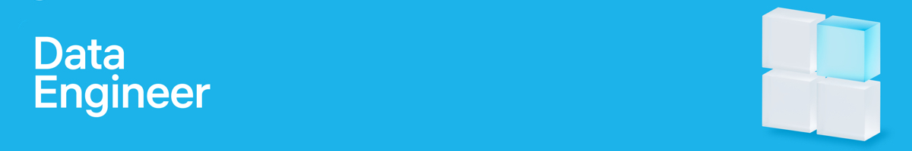

# Открытая школа Apache Spark+Scala. Репозиторий проектов.

## Описание

Открытая школа – это практический курс, рассчитанный на 16 часов очной практики и 32 часа самостоятельной работы.

Проект включает в себя разработку ETL-пайплайнов для обработки и анализа больших данных. Используя инструменты Scala и Apache Spark, реализованы решения для обработки данных в рамках Hadoop экосистемы. AirFlow используется для организации и автоматизации рабочих процессов.

## Технологии
- Apache Spark
- Hadoop
- Apache AirFlow
- Scala
- SQL
- ETL

## Структура

| Номер проекта                | Название проекта                          | Краткое описание                                                                                                     |
|------------------------------|-------------------------------------------|----------------------------------------------------------------------------------------------------------------------|
| [Проект 8](final_project8) | Пайплайн обработки и трансформации данных | Разработка ETL-пайплайна для загрузки и обработки данных из разных источников, создание широкой таблицы и витрины данных в Hadoop, а также их выгрузка в PostgreSQL. |
| [Проект 7](project7)       | Эмуляция Data Skew                        | Решение проблемы перекоса данных в Spark, включая генерацию и оптимизацию DataFrame с Data Skew.                     |
| [Проект 6](project6)       | Автоматизированный Data Pipeline          | Создание DAG в Airflow для автоматизации процесса проверки и подсчета строк в таблице Hadoop, отправка результатов по электронной почте. |
| [Проект 5](project5)       | Работа с данными в Hadoop и PostgreSQL    | ETL-операции в Hadoop и PostgreSQL, включая загрузку данных и создание широкой и отфильтрованных таблиц.             |
| [Проект 4](project4)       | Анализ данных популярных песен и артистов | Анализ данных о популярных песнях и артистах с использованием Spark, включая оптимизацию запросов.                   |
| [Проект 3](project3)       | Задания по Scala и Apache Spark           | Решение задач на Scala с использованием Spark, включая работу с датасетами, DataFrame, агрегирование и ранжирование данных. |
| [Проект 2](project2)       | Задание по Apache Spark (PySpark)         | Использование PySpark для обработки и агрегации больших данных, включая создание RDD и DataFrame.                    |
| [Проект 1](project1)       | Задание на MapReduce                      | Решение задачи поиска числа в массиве с использованием MapReduce в HDFS.                                             |
| [Проект 0](project0)       | Задание на запуск Hadoop в Docker         | Работа с Hadoop HDFS в Docker, включая создание директорий, управление файлами и настройку контейнеров.              |
